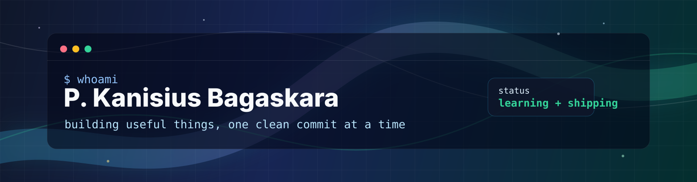

  

<h1 align="center">Hi, I'm P. Kanisius Bagaskara</h1>

  <strong>AI/ML enthusiast from Tangerang, Indonesia</strong> 
  Building intelligent systems, clean tools, and data-driven experiments.

  
  
  

---

### About Me

I'm an AI/ML learner and builder from Universitas Pamulang who enjoys turning ideas into practical projects. I like clean interfaces, useful automation, and models that solve real problems instead of just looking fancy in a notebook.

- Focus: machine learning, computer vision, data science, and practical app development
- Current mode: learning deeply, shipping consistently, and refining every project
- Open to: collaborations, AI/ML discussions, and project feedback

### Tech Stack

**Languages**

  
  
  
  

**AI/ML & Data**

  
  
  
  
  
  

**Tools**

  
  
  
  
  
  

### Featured Work

| Area | What I Like Building | Tools I Reach For |
| --- | --- | --- |
| Computer Vision | Detection, classification, image pipelines | OpenCV, PyTorch, TensorFlow |
| Data Science | Analysis, modeling, experiment notebooks | Pandas, NumPy, Scikit-Learn |
| Apps & Tools | Dashboards, demos, small automation | Python, Streamlit, JavaScript |

### GitHub Pulse

  
  

  

  

  

---

  <strong>Let's build something useful.</strong> 
  Always learning, always iterating, always making the next version cleaner.

