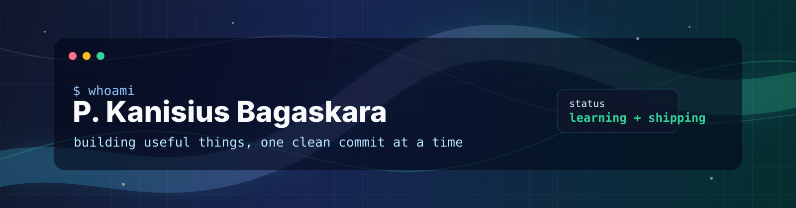

  

<h1 align="center">P. Kanisius Bagaskara</h1>

  <strong>AI/ML engineer in the making</strong> &middot; Tangerang, Indonesia 
  Building intelligent systems, useful tools, and products that actually ship.

  
  
  

---

### Focus

- **Machine Learning & Data Science** — fraud-risk detection, model training, and algorithms reimplemented from scratch for understanding
- **Computer Vision** — detection, classification, and image pipelines
- **Product Engineering** — Next.js and TypeScript apps, dashboards, and automation people actually use

### Featured Projects

| Project | What it is | Stack |
| :--- | :--- | :--- |
| [Deep-Dive-into-ML](https://github.com/knsiuss/Deep-Dive-into-ML) | ML curriculum where every algorithm is implemented from scratch with mathematical rigor, built alongside Stanford CS229 | Python, Jupyter |
| [ieee-fraud-detection](https://github.com/knsiuss/ieee-fraud-detection) | Sentinel — a production-inspired fraud-risk decisioning platform on the IEEE-CIS dataset | Python, Gradio |
| [f1lab](https://github.com/knsiuss/f1lab) | Real-time F1 analytics dashboard with telemetry, race replay, and ML predictions | Python, Streamlit, FastF1, Plotly |
| [spotify-downloader](https://github.com/knsiuss/spotify-downloader) | Spotify downloader with desktop and web clients | TypeScript |
| [web-portfolio](https://github.com/knsiuss/web-portfolio) | Personal portfolio site | Next.js, TypeScript |
| [sela](https://github.com/knsiuss/sela) | WhatsApp/SMS-first AI agent that books and reschedules appointments for SMB service businesses | TypeScript |
| [sland](https://github.com/knsiuss/sland) | Pomodoro, now playing, and system glance in a single desktop island | JavaScript |

### Tech Stack

**Languages**

  
  
  
  
  

**AI/ML & Data**

  
  
  
  
  
  
  
  
  

**Apps & Platforms**

  
  
  
  
  
  
  
  

### GitHub Activity

  
  

  

---

  <strong>Let's build something useful.</strong> 
  Always learning, always iterating, always making the next version cleaner.

